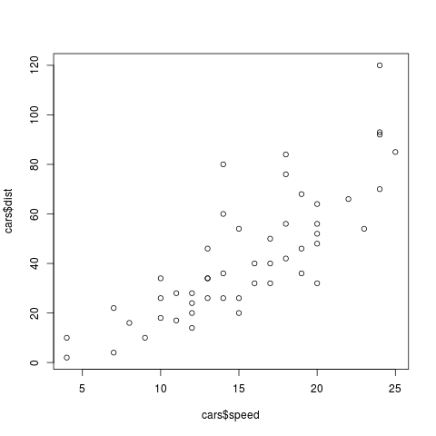
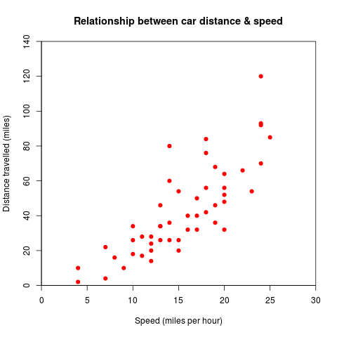

read_R_Graphs_Cookbook
======================

this my personal notes of reading R Graphs Cookbook. No commercial use!

第一章 基本图形函数（Basic Graph Functions）

=============================================================
 
###
创建散点图 scatter plot

函数:  `plot(y~x)`

用R内置的数据集cars来做简单的例子：

>`
>plot(cars$dist~cars$speed)
>`

如图：

>`
>plot(cars$dist~cars$speed, main="Relationship between car distance & speed",xlab="Speed (miles per hour)",ylab="Distance travelled (miles)",xlim=c(0,30),ylim=c(0,140),xaxs="i",yaxs="i",col="red", pch=19)
>`

得到：

其中：

>`main="Relationship between car distance & speed",
>` # 设置标题

>`xlab="Speed (miles per hour)", 
>`#设置X轴标签

>`ylab="Distance travelled (miles)", 
>`#设置Y轴标签

>`xlim=c(0,30),
>`#设置X轴刻度从0到30

>`ylim=c(0,140),
>` #设置Y轴刻度从0到140

>`xaxs="i", 
>`#Set x axis style as internal

>`yaxs="i", 
>`#Set y axis style as internal

>`col="red",
>` #Set the color of plotting symbol to red

>`pch=19
>`#Set the plotting symbol to filled dots

除了`plot(y~x)`，还可以用`plot(x,y)`，具体参数想见`plot()`的参数解释。

 
###
创建线图 line graph

##第二章
